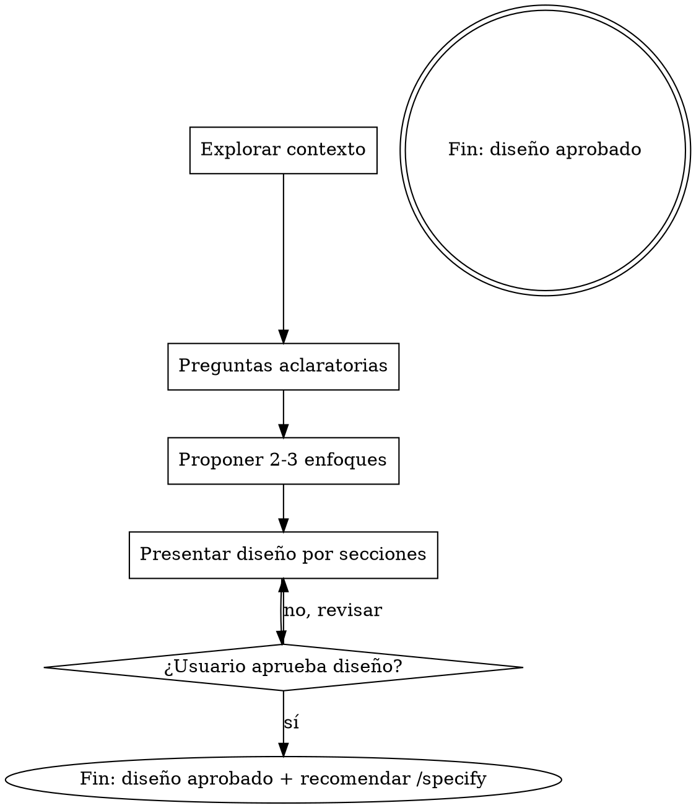

# Brainstorming: clarificar ideas

Convertir una idea vaga en un diseño claro mediante diálogo colaborativo. El alcance de este skill es **solo clarificar**: entender el problema, explorar enfoques y llegar a un diseño aprobado. Escribir el spec, planificar la implementación y codear están **fuera de alcance**.

Empezá entendiendo el contexto del proyecto, después hacé preguntas de a una para refinar la idea. Cuando ya sepas qué se va a construir, presentá el diseño y esperá aprobación del usuario.

<HARD-GATE>
NO escribas specs, NO escribas código, NO invoques automáticamente otros skills, NO scaffolding. Este skill termina cuando el usuario aprueba el diseño verbalmente. Aplica a TODO proyecto, sin importar cuán simple parezca. Al cerrar podés **recomendar** el siguiente skill del workflow (`/specify`), pero la invocación la hace el usuario, no vos.
</HARD-GATE>

## Anti-patrón: "esto es muy simple para necesitar diseño"

Todo proyecto pasa por este proceso. Una to-do list, una función utilitaria, un cambio de config — todos. Los proyectos "simples" son donde las suposiciones no examinadas causan más trabajo desperdiciado. El diseño puede ser corto (unas pocas oraciones para lo realmente trivial), pero DEBE ser presentado y aprobado.

## Checklist

Creá una tarea por cada ítem y completalos en orden:

1. **Explorar contexto del proyecto** — revisar archivos, docs, commits recientes
2. **Ofrecer el companion visual just-in-time** — NO al inicio. La primera vez que una pregunta sea más clara mostrándola que describiéndola, ofrecelo (en su propio mensaje). Si nunca surge una pregunta visual, no lo ofrezcas. Ver la sección Companion Visual más abajo.
3. **Hacer preguntas aclaratorias** — de a una, entendiendo propósito, restricciones y criterio de éxito
4. **Proponer 2-3 enfoques** — con trade-offs y tu recomendación
5. **Presentar el diseño** — en secciones escaladas a su complejidad, pidiendo aprobación después de cada una
6. **Cierre y handoff a `/specify`** — cuando el usuario apruebe el diseño completo, cerrar con un resumen breve **y recomendar explícitamente correr `/specify`** como siguiente paso del workflow del proyecto (definido en `CLAUDE.md`: brainstorm → spec → ejecución TDD → verificación → commit). No invocar `/specify` automáticamente — solo recomendarlo. Este skill termina acá.

## Flujo del proceso

El paso final del brainstorming es **recomendar** `/specify` (nunca invocarlo automáticamente). Ver la sección "Cierre" para el texto exacto del handoff.

## El proceso en detalle

**Entender la idea:**

- Primero revisá el estado actual del proyecto (archivos, docs, commits recientes).
- Antes de meterte en preguntas de detalle, evaluá el scope: si el pedido describe varios subsistemas independientes (por ejemplo, "una plataforma con chat, storage, billing y analytics"), flag inmediato — no gastes preguntas refinando algo que primero hay que descomponer.
- Si el proyecto es muy grande para un solo diseño, ayudá al usuario a descomponerlo en sub-proyectos: qué piezas independientes hay, cómo se relacionan, en qué orden construirlas. Después hacé brainstorm del primer sub-proyecto por el flujo normal.
- Para proyectos de scope apropiado, preguntas de a una para refinar la idea.
- Preferí preguntas de opción múltiple cuando sea posible, pero las abiertas también sirven.
- Una sola pregunta por mensaje. Si un tema necesita más exploración, partilo en varias preguntas.
- Foco en entender: propósito, restricciones, criterio de éxito.

**Explorar enfoques:**

- Proponé 2-3 enfoques con trade-offs.
- Presentá las opciones conversacionalmente con tu recomendación y razonamiento.
- Empezá con tu opción recomendada y explicá por qué.
- YAGNI implacable — sacá features innecesarias de cada enfoque y del diseño.

**Presentar el diseño:**

- Cuando creas entender qué se va a construir, presentá el diseño.
- Escalá cada sección a su complejidad: unas pocas oraciones si es directo, hasta 200-300 palabras si es sutil.
- Después de cada sección, preguntá si va bien.
- Cubrí: arquitectura, componentes, flujo de datos, manejo de errores, testing.
- Estate listo para volver atrás y aclarar si algo no cierra.

**Diseño para aislamiento y claridad:**

- Partí el sistema en unidades chicas, cada una con un propósito claro, que se comuniquen por interfaces bien definidas y que puedan entenderse y testearse de forma independiente.
- Por cada unidad, tenés que poder responder: qué hace, cómo se usa, de qué depende.
- ¿Alguien puede entender qué hace una unidad sin leer sus internals? ¿Podés cambiar los internals sin romper a los consumidores? Si no, los límites necesitan trabajo.

**Trabajando en código existente:**

- Explorá la estructura actual antes de proponer cambios. Seguí los patrones existentes.
- Cuando el código existente tenga problemas que afecten el trabajo (archivo muy grande, límites poco claros, responsabilidades enredadas), incluí mejoras puntuales como parte del diseño.
- No propongas refactors no relacionados. Mantenete enfocado en lo que sirve al objetivo actual.

## Cierre y handoff a `/specify`

Cuando el usuario apruebe el diseño completo, cerrá con un resumen breve del diseño acordado **y recomendá explícitamente el siguiente skill del workflow**: `/specify`.

El workflow del proyecto (definido en `CLAUDE.md`) es: **brainstorm → spec (docs/) → ejecución (TDD) → verificación → commit**. Este skill cubre el primer paso; `/specify` cubre el segundo, tomando el diseño que acabás de acordar y materializándolo en `docs/specs/<slug>/requirements.md` y `docs/specs/<slug>/design.md`.

Usá exactamente este texto de cierre (adaptando el resumen al diseño real acordado):

> "**Diseño aprobado.** Resumen: {{2-3 líneas con lo esencial del diseño}}.
>
> El siguiente paso del workflow es materializar esto en un spec versionado. Recomiendo correr:
>
> `/specify`
>
> Ese skill toma el diseño que acabamos de acordar (lo va a leer del contexto de esta conversación, no vas a tener que re-explicarlo) y genera `requirements.md` + `design.md` bajo `docs/specs/`. Si preferís no hacer el spec ahora, decime — también podemos dejarlo asentado y seguir después."

**Reglas importantes del handoff:**

- **Recomendar, no invocar.** No llames vos a `/specify` con la herramienta `Skill`. La invocación la hace el usuario tipeando el comando. Esto respeta el HARD-GATE y le da control explícito.
- **No escribas el spec vos mismo.** Aunque el usuario diga "sí, dale con el spec", esperá a que corra `/specify` — es ese skill el que tiene los templates y el flujo con approval gates.
- **No empieces a codear.** La implementación (TDD) es un paso posterior, después del spec.
- **Si el usuario elige no correr `/specify`,** cerrá limpio con "Ok, brainstorming asentado" y devolvé el control. No insistas.

## Companion Visual

Un companion basado en navegador para mostrar mockups, diagramas y opciones visuales durante el brainstorming. Es una **herramienta, no un modo**. Aceptar el companion significa que está disponible para preguntas que se beneficien de tratamiento visual; NO significa que toda pregunta pase por el navegador.

**Ofrecer el companion (just-in-time):** NO lo ofrezcas al inicio. Esperá hasta que una pregunta genuinamente sea más clara mostrándola — una pregunta real de mockup / layout / diagrama, no meramente un *tema* de UI. La primera vez que eso pase, ofrecelo, en su propio mensaje:

> "Esta parte quizá sea más clara si te la muestro — puedo armar mockups, diagramas y comparaciones en una pestaña del navegador a medida que avanzamos. ¿La abro?"

**Esta oferta DEBE ser su propio mensaje.** Solo la oferta — sin pregunta aclaratoria, sin resumen, sin otro contenido. Esperá la respuesta del usuario. Si acepta, abrí la pestaña. Si rechaza, seguí solo con texto y no vuelvas a ofrecer salvo que el usuario lo saque.

**Decisión por pregunta:** Incluso después de que el usuario acepte, decidí PARA CADA PREGUNTA si conviene el navegador o la terminal. El test: **¿el usuario va a entender mejor viéndolo que leyéndolo?**

- **Navegador** para contenido que ES visual — mockups, wireframes, comparaciones de layout, diagramas de arquitectura, diseños lado a lado.
- **Terminal** para contenido que es texto — preguntas de requisitos, elecciones conceptuales, listas de tradeoffs, opciones A/B/C/D en texto, decisiones de scope.

Una pregunta sobre un tema de UI no es automáticamente una pregunta visual. "¿Qué significa personalidad en este contexto?" es una pregunta conceptual — usá terminal. "¿Cuál de estos dos layouts de wizard funciona mejor?" es visual — usá navegador.
