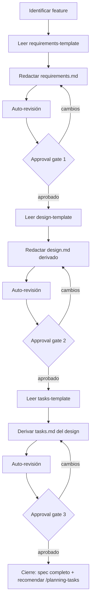

# Specify: de idea a spec estructurado

Convierte una feature acordada en tres documentos formales, siguiendo el enfoque **Requirements-First** inspirado en Kiro: primero se acuerda el comportamiento esperado en `requirements.md` con notación EARS, luego se deriva la arquitectura en `design.md`, y finalmente se genera el plan de implementación en `tasks.md`. Cada documento pasa por un approval gate antes de continuar.

**Alcance de este skill:** exclusivamente los archivos `requirements.md`, `design.md` y `tasks.md`. No genera código de implementación. Cuando las tareas quedan aprobadas, el skill termina y devuelve el control al usuario.

<HARD-GATE>
NO escribas código de implementación, NO crees tests, NO invoques skills de ejecución. Este skill produce documentación estructurada (requirements, design y tasks) y nada más. Si el usuario pide "implementalo" durante la sesión, respondé con el estado del spec y aclará que la implementación es un paso posterior.
</HARD-GATE>

## Cuándo aplica este skill

- El usuario terminó un brainstorming y quiere formalizarlo (típico: viene de [brainstorming/SKILL.md](../brainstorming/SKILL.md) con un diseño verbalmente aprobado).
- El usuario tiene una idea clara de una feature y pide "hacer el spec", "documentar", "escribir los requisitos".
- El usuario menciona Kiro, EARS, requirements-first, o pide seguir un flujo estructurado tipo requisitos → diseño.

Si la idea todavía es vaga (el usuario no sabe qué construir), primero se hace brainstorming. Este skill asume que **el problema ya está entendido** — se dedica a estructurarlo.

## Encadenamiento con brainstorming

El skill `brainstorming` termina con un diseño aprobado en la conversación (verbal, no en archivos). Cuando se encadena:

1. Extraer del contexto de la conversación: propósito, restricciones, criterio de éxito, enfoque elegido, decisiones de arquitectura.
2. NO re-preguntar lo que ya se acordó. Usar ese contexto como insumo directo del borrador de `requirements.md`.
3. Si algo del brainstorm quedó ambiguo para escribir en EARS, ahí sí preguntar puntualmente — pero de a una y solo lo necesario.

Si no hay brainstorm previo, arrancar por el paso 1 del proceso normal (identificar la feature y su contexto).

## Proceso

Este skill tiene dos fases separadas por un approval gate. Crear una tarea por cada paso y trackear el progreso.

### Fase 1 — Requirements

1. **Identificar la feature.** Nombre en snake-case corto y descriptivo (`categorizador_csv`, `comparador_csv`, `login_oauth`). Este nombre será el slug de la carpeta.

2. **Determinar la carpeta destino.** Los specs viven en `docs/specs/<slug>/`. Verificar si ya existe; si sí, preguntar si se sobreescribe o se crea un slug alternativo (`<slug>-v2`).

3. **Leer el template.** Cargar [assets/requirements-template.md](./assets/requirements-template.md) como base. Es una plantilla — hay que llenarla y podés recortar secciones vacías si no aplican a la feature (por ejemplo, no forzar RNFs si no hay ninguno real).

4. **Redactar el borrador.** Llenar el template usando el contexto disponible (brainstorm previo + input directo del usuario). Reglas de escritura para requisitos funcionales:
   - **Un requisito por línea.** Si aparece un "y" que junta dos comportamientos, partilo.
   - **EARS estricto** para RFs: `WHEN <condición o evento> THE SYSTEM SHALL <comportamiento>`. Nada de "el sistema debería idealmente..." — es imperativo y verificable.
   - **Numeración estable:** `RF-1`, `RF-2`, `RNF-1`. No re-numerar entre revisiones si podés evitarlo (rompe trazabilidad).
   - **Criterios de aceptación** derivados de los RFs, redactados como casos observables sí/no.

5. **Escribir el archivo** a `docs/specs/<slug>/requirements.md`. Crear el directorio si no existe.

6. **Auto-revisión rápida** antes de mostrar al usuario:
   - ¿Hay algún `{{placeholder}}` sin reemplazar? Arreglalo.
   - ¿Algún RF tiene condiciones ambiguas ("cuando sea necesario", "en algunos casos")? Rescribilo con condición concreta.
   - ¿La sección "Preguntas abiertas" está vacía? Si no, esas preguntas deben resolverse antes del approval gate.

7. **Approval gate 1.** Mostrar al usuario un resumen (no volcar el archivo completo salvo que lo pida) y pedir aprobación explícita:

   > "`requirements.md` escrito en `<ruta>`. Resumen: {{N RFs, M RNFs, K criterios de aceptación, resumen de alcance}}. ¿Lo aprobás como está, o querés cambios antes de pasar a design?"

   Si pide cambios, aplicarlos, re-correr la auto-revisión y volver a preguntar. **No pasar a Fase 2 hasta que apruebe explícitamente.**

### Fase 2 — Design

8. **Leer el template de diseño.** Cargar [assets/design-template.md](./assets/design-template.md).

9. **Derivar el diseño desde los requisitos.** Cada sección del design debe poder trazarse a requisitos concretos:
   - Arquitectura y componentes → cubren qué RFs.
   - Interfaces → los contratos que hacen posibles los RFs.
   - Modelos de datos → las estructuras que aparecen en RFs y criterios de aceptación.
   - Manejo de errores → un caso por cada RF que involucre entrada inválida o falla externa.
   - Estrategia de testing → mapear los tests a los RFs que verifican.
   - Alternativas consideradas → si vino de brainstorm, dejar registradas las opciones descartadas y por qué.

10. **YAGNI implacable.** No inventes componentes por completar el template. Si una sección no aplica (por ejemplo, un script sin dependencias externas no necesita hablar de "servicios externos"), quitala o marcala explícitamente como *no aplica*.

11. **Escribir el archivo** a `docs/specs/<slug>/design.md`.

12. **Auto-revisión del design:**
    - ¿Todo `{{placeholder}}` reemplazado?
    - ¿Cada RF del requirements.md está cubierto por al menos un componente/interface/manejo de error del design?
    - ¿Hay contradicciones entre secciones? (ej: la arquitectura dice "sin base de datos" y el modelo de datos define una tabla).
    - ¿La sección "Preguntas abiertas" está vacía?

13. **Approval gate 2.** Mostrar resumen y pedir aprobación:

    > "`design.md` escrito en `<ruta>`. Cubre {{N componentes, M interfaces, K casos de error}}. ¿Aprobado, o cambios?"

    Si pide cambios, aplicarlos, re-revisar, y volver a preguntar.

### Fase 3 — Tasks

14. **Leer el template de tareas.** Cargar [assets/tasks-template.md](./assets/tasks-template.md).

15. **Derivar las tareas desde el diseño.** Cada tarea debe poder trazarse a componentes e interfaces del design y a los RFs del requirements:
    - Ordenar por dependencia: las tareas que desbloquean a otras van primero.
    - Un scope acotado por tarea — si una tarea cubre más de 2-3 RFs, probablemente se puede partir.
    - El tipo (setup, feature, refactor, test) ayuda a entender la naturaleza del trabajo.
    - Los criterios de done deben ser verificables (idealmente mapeables a tests).
    - El log de decisiones se deja vacío — se llena durante la implementación, no antes.

16. **YAGNI implacable.** No crear tareas especulativas. Si el design tiene N componentes simples, no forzar N tareas — agrupar lo que tenga sentido implementar junto.

17. **Escribir el archivo** a `docs/specs/<slug>/tasks.md`.

18. **Auto-revisión del tasks:**
    - ¿Todo `{{placeholder}}` reemplazado?
    - ¿Cada RF del requirements.md está cubierto por al menos una tarea?
    - ¿El orden de dependencia es coherente? (no depender de algo que se implementa después).
    - ¿Hay tareas sin criterio de done? Agregarlo.

19. **Approval gate 3.** Mostrar resumen y pedir aprobación:

    > "`tasks.md` escrito en `<ruta>`. Contiene {{N tareas}}, cubriendo todos los RFs. ¿Aprobado, o cambios?"

    Si pide cambios, aplicarlos, re-revisar, y volver a preguntar.

### Cierre y handoff a `/planning-tasks`

Cuando los tres archivos están aprobados, cerrar con:

> "Spec completo en `docs/specs/<slug>/`:
> - `requirements.md` — {{N RFs}}
> - `design.md` — arquitectura y contratos
> - `tasks.md` — {{N tareas}} de implementación
>
> Specify terminado. Este skill no genera código. El siguiente paso del workflow es iterar y refinar el plan de tareas. Recomiendo correr:
>
> `/planning-tasks`
>
> Ese skill lanza subagentes `planner` que evalúan cada tarea contra el spec (tamaño, alineación, completitud, necesidad, factibilidad) y refinan `tasks.md` hasta que todos los RFs estén cubiertos al 100%. Si preferís no iterar el plan ahora, podés pasar directamente a implementación."

**Reglas del handoff:**

- **Recomendar, no invocar.** No llames vos a `/planning-tasks` con la herramienta `Skill`. La invocación la hace el usuario.
- **No empieces a codear.** La implementación (TDD) es un paso posterior, después de que el plan esté iterado.
- **Si el usuario elige no correr `/planning-tasks`,** cerrá limpio con "Ok, spec completo" y devolvé el control.

## Flujo del proceso

## Templates

Este skill viene con dos plantillas en `assets/` que estructuran la salida:

- [assets/requirements-template.md](./assets/requirements-template.md) — Estructura de requisitos con secciones: contexto, actores, alcance, RFs en EARS, RNFs, criterios de aceptación, suposiciones, preguntas abiertas.
- [assets/design-template.md](./assets/design-template.md) — Estructura de diseño con: resumen ejecutivo, arquitectura, flujo de datos, interfaces, modelos de datos, manejo de errores, estrategia de testing, alternativas, riesgos, preguntas abiertas.
- [assets/tasks-template.md](./assets/tasks-template.md) — Estructura de tareas con: orden por dependencia, trazabilidad a RFs y componentes, criterio de done verificable, log de decisiones por tarea.

**Sobre los templates:** son un andamio, no un formulario. Si una sección no aplica a la feature (por ejemplo, no hay riesgos relevantes en un script trivial), quitala. Preferí un spec corto y completo antes que uno largo con secciones rellenadas por compromiso.

## Reglas de escritura importantes

**Los RFs deben ser verificables.** Un buen test para cada RF: ¿puedo escribir un test automatizado que devuelva pass/fail sobre este comportamiento? Si no, está mal redactado.

**El design existe para servir a los requirements.** Cada decisión de arquitectura debe rastrearse a un requisito. Si aparece un componente que no cubre ningún RF, o es scope creep o falta un RF.

**Un archivo por concepto.** No mezclar requirements y design en un mismo archivo. La separación es intencional — los requirements viven más tiempo que el design (podés reimplementar cambiando el design sin tocar los requisitos).

**Ambigüedad = bloqueo.** Un RF ambiguo o un design con `{{placeholders}}` sin llenar no pasa el approval gate. Preguntá lo necesario antes de mostrar al usuario, no después.
