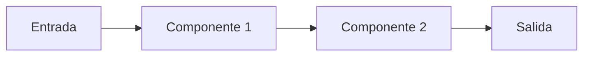

# Design — {{FEATURE_NAME}}

- **Fecha:** {{YYYY-MM-DD}}
- **Estado:** Borrador | Aprobado
- **Requirements:** [requirements.md](./requirements.md)

## 1. Resumen ejecutivo

Un párrafo (3-5 oraciones) que responde: qué se construye, cómo funciona a alto nivel, y qué requisitos cubre.

## 2. Arquitectura

Diagrama o descripción textual de los componentes principales y su relación. Mermaid recomendado si el diagrama aporta. Si es un solo script, decilo — no inventar cajas.



**Componentes:**
- **{{Componente 1}}** — responsabilidad única en una oración.
- **{{Componente 2}}** — responsabilidad única en una oración.

## 3. Flujo de datos

Cómo se mueven los datos por el sistema, paso a paso. Un flujo por escenario principal.

**Flujo principal:**
1. {{Entrada X llega desde Y}}
2. {{Componente Z la transforma en W}}
3. {{Salida se emite hacia V}}

## 4. Interfaces

Contratos entre componentes y con el mundo exterior: CLI, funciones públicas, endpoints, formato de archivos.

**CLI / API pública:**
```
{{python categorizar.py <archivo.csv>}}
```

**Funciones/módulos principales:**
- `nombre_funcion(params) -> tipo_retorno` — {{qué hace en una oración}}

## 5. Modelos de datos

Estructuras principales que circulan por el sistema. Solo las relevantes al diseño — no volcar el esquema completo de la DB si no aporta.

```
Transaccion:
  fecha: date
  descripcion: str
  monto: decimal
  categoria: str  # asignada por el sistema
```

## 6. Manejo de errores

Por cada tipo de error, qué hace el sistema y qué ve el usuario. Cubrir al menos: entrada inválida, dependencia externa caída, estado inesperado.

| Situación | Comportamiento | Mensaje al usuario |
|---|---|---|
| {{Archivo no existe}} | {{Exit 1 sin stacktrace}} | {{"Error: archivo X no encontrado"}} |
| {{Fila malformada}} | {{Log a stderr, seguir}} | {{"Advertencia: fila N ignorada"}} |

## 7. Estrategia de testing

Qué se prueba, cómo y con qué herramienta. Mapear los tests a los requisitos donde tenga sentido.

- **Unitarios:** {{funciones puras — RF-1, RF-3}}
- **Integración:** {{flujo end-to-end con CSV de fixture — RF-2}}
- **Casos borde a cubrir:** {{CSV vacío, monto no numérico, encoding raro}}
- **Herramienta:** {{pytest / vitest / etc.}}

## 8. Alternativas consideradas

Si en el brainstorm se evaluaron enfoques que se descartaron, dejarlos anotados con la razón. Ayuda a futuros lectores a no re-abrir decisiones cerradas.

- **{{Enfoque B: YAML externo de reglas}}** — descartado por sobreingeniería para el scope actual (una sola fuente de CSV).

## 9. Riesgos y mitigaciones

- **Riesgo:** {{descripción}} → **Mitigación:** {{qué se hace}}

## 10. Preguntas abiertas

Cualquier cosa que sigue sin resolverse. Si no está vacío, el diseño no está listo para aprobar.

- {{Pregunta}}
