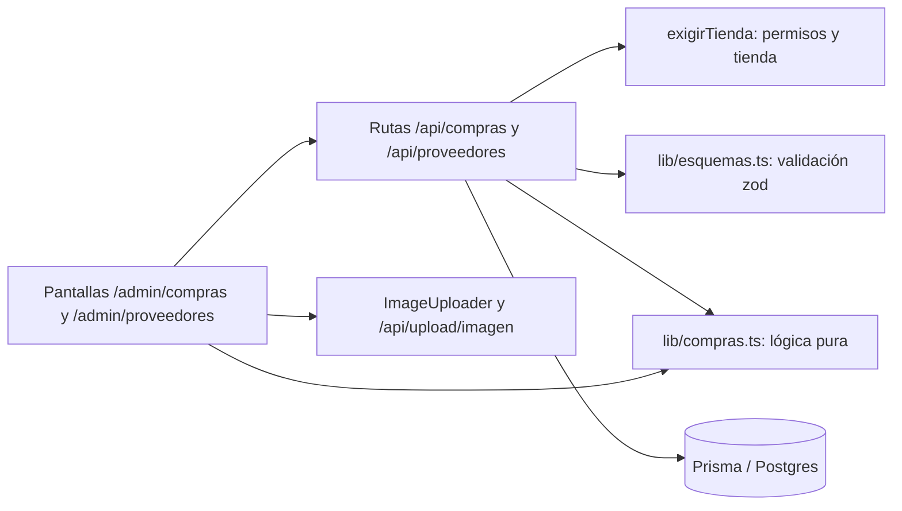

# Design — Módulo de compras

- **Fecha:** 2026-10-02
- **Estado:** Aprobado
- **Requirements:** [requirements.md](./requirements.md)

## 1. Resumen ejecutivo

Se agrega un módulo de compras con cuatro tablas nuevas (`proveedores`, `compras`, `compras_items`, `compras_costos_extra`), un archivo de lógica pura `lib/compras.ts` (reparto de costos, completado de campos vacíos, nombres parecidos) y rutas API propias. Guardar una compra ejecuta en **una sola transacción** la creación de los productos nuevos, el completado de los existentes, el aumento atómico del stock, el costo final y los movimientos de inventario. La anulación revierte el stock con la misma garantía. Sigue los patrones ya usados por facturas y liquidaciones: permisos por módulo, tienda tomada de la sesión, validación con zod, SQL en `docs/sql/` y pantallas bajo `app/admin`. Cubre RF-1 a RF-52.

## 2. Arquitectura



`lib/compras.ts` no toca la base: lo usan tanto el servidor como la pantalla, para que lo que el comprador ve (reparto, diferencias) sea exactamente lo que el servidor calcula.

**Componentes:**
- **`lib/compras.ts`** — lógica pura: reparto de costos, costo final, campos a completar, nombres parecidos.
- **Esquema `compraNueva` en `lib/esquemas.ts`** — valida el cuerpo de la compra antes de tocar la base.
- **`/api/proveedores`** — crear, editar y listar proveedores.
- **`/api/compras`** — listar y crear compras; **`/api/compras/[id]`** detalle; **`/api/compras/[id]/anular`** anulación.
- **`/api/compras/verificar`** — clasifica las líneas (existente, nuevo, nuevo con parecidos) mientras el comprador escribe.
- **`/api/productos/[id]/compras`** — historial de compras de un producto.
- **Pantallas** — lista de compras, nueva compra, detalle, proveedores; más la sección de historial en la ficha del producto.
- **Barra lateral** — grupo nuevo "Compras" en `app/admin/layout.tsx`.
- **`docs/sql/compras.sql`** — tablas, índices, aislamiento por tienda y permisos.

## 3. Flujo de datos

**Registrar una compra (RF-6 a RF-33)**
1. El comprador elige proveedor, fecha y número de factura, y agrega líneas. Por cada SKU escrito, la pantalla llama a `/api/compras/verificar`, que devuelve `existente` (con el producto completo), `nuevo` o `nuevo_con_parecidos` (con hasta tres candidatos).
2. Ante `nuevo_con_parecidos` el comprador elige "es ese producto" (la línea pasa a `existente`) o "crear uno nuevo" (la línea queda con `confirmadoNuevo: true`).
3. Las imágenes se suben con `ImageUploader` y la línea guarda la URL.
4. La pantalla calcula con `lib/compras.ts` el reparto de extras, los costos finales y las diferencias, y muestra el resumen de confirmación (RF-33).
5. `POST /api/compras` valida con zod y comprueba permisos (`compras.crear`, y `productos.crear` si hay líneas nuevas).
6. El servidor **recalcula todo** (reparto, costos, clasificación de cada línea contra la base) sin fiarse de la pantalla.
7. Una transacción hace, en orden: crear la compra, sus costos extra y líneas; por cada línea nueva crear el producto; por cada línea existente completar los campos vacíos; incrementar el stock de forma atómica; fijar el costo y `costoUpdatedAt`; crear el movimiento.
8. Fuera de la transacción se escribe la auditoría (si falla, se registra el error y la compra sigue siendo válida, como en facturas).

**Anular (RF-34 a RF-40)**
1. `POST /api/compras/[id]/anular` con `motivo`.
2. En una transacción: marcar la compra como anulada solo si sigue `registrada`; por cada línea, restar el stock con una actualización condicionada a que alcance; crear el movimiento de salida. Si alguna línea no alcanza, se deshace todo y se responde con el producto y la cantidad faltante.

## 4. Interfaces

**Rutas** (todas con la tienda de la sesión; el cuerpo nunca trae `tiendaId`):

| Ruta | Permiso | Qué hace |
|---|---|---|
| `GET /api/proveedores` | `compras.ver` | lista de la tienda |
| `POST /api/proveedores` | `compras.crear` | crea (RF-1, RF-2) |
| `PATCH /api/proveedores/[id]` | `compras.crear` | edita (RF-3) |
| `GET /api/compras` | `compras.ver` | lista paginada, filtros `proveedorId`, `desde`, `hasta` |
| `POST /api/compras` | `compras.crear` (+ `productos.crear`) | registra |
| `GET /api/compras/[id]` | `compras.ver` | detalle |
| `POST /api/compras/[id]/anular` | `compras.anular` | anula con motivo |
| `POST /api/compras/verificar` | `compras.crear` | clasifica líneas |
| `GET /api/productos/[id]/compras` | `compras.ver` | historial del producto |

**Cuerpo de `POST /api/compras`** (esquema `compraNueva`):
```
proveedorId: uuid
fecha: fecha ISO
numeroFacturaProveedor?: texto (máx. 100)
observaciones?: texto
metodoReparto: 'valor' | 'cantidad'
costosExtra: [{ concepto, valor > 0 }]
items (1 a 100): [{
  productoId?: uuid            // presente si la línea es de un producto existente
  confirmadoNuevo?: boolean    // true si se descartó el aviso de parecidos
  sku, nombre, categoria, dimensiones?, color?, acabado?,
  espesorMm?, m2PorCaja?, precioUnitario?, precioBodega?, stockMinimo?,
  descripcion?, imagenUrl?,
  cantidad > 0, precioFactura >= 0,
  costoFinalManual?: número >= 0   // solo si la persona lo retocó a mano
}]
```

**Funciones de `lib/compras.ts`:**
- `repartirCostosExtra(lineas, totalExtras, metodo) -> number[]` — reparto que suma exactamente el total; el centavo sobrante va a la línea de mayor valor.
- `costoFinalUnitario(precioFactura, cantidad, extraRepartido, manual?) -> number` — RF-24 y RF-25.
- `camposACompletar(producto, linea) -> { completar, diferencias }` — qué campos nulos se llenan y cuáles difieren (RF-16, RF-17).
- `nombresParecidos(nombre, productos, limite) -> Producto[]` — RF-10.
- `normalizarNombre(texto) -> string` — minúsculas, sin tildes ni espacios sobrantes.

## 5. Modelos de datos

```
Proveedor:   id, tiendaId, nombre*, nit?, telefono?, email?, direccion?, createdAt, updatedAt
             único (tiendaId, nit) cuando hay NIT

Compra:      id, tiendaId, proveedorId, numeroFacturaProveedor?, fecha,
             subtotal, totalExtras, total (Decimal 14,2),
             metodoReparto ('valor'|'cantidad'),
             estado ('registrada'|'anulada'), observaciones?,
             creadaPor, createdAt,
             anuladaPor?, anuladaEn?, motivoAnulacion?

CompraItem:  id, compraId, productoId, productoNombre (copia al comprar),
             productoCreado (bool), cantidad, precioFactura,
             costoExtra (parte repartida), costoFinal (por unidad),
             costoEditado (bool)

CompraCostoExtra: id, compraId, concepto, valor
```

- **Único parcial** en `compras (tiendaId, proveedorId, numeroFacturaProveedor)` donde `estado <> 'anulada'` y el número no es nulo (RF-7). Prisma no declara índices parciales: vive en el SQL, igual que `productos_tienda_sku_activo_key`, y se avisa en un comentario del schema.
- **Productos:** no cambia su estructura. El historial de compras de un producto sale de `compras_items`.
- **Movimiento de inventario:** se usa la tabla existente. Compra: `tipo = 'entrada'`, `referenciaTipo = 'compra'`, `referenciaId = compra.id`. Anulación: `tipo = 'salida'`, `referenciaTipo = 'anulacion_compra'`. Es el mismo criterio que las facturas (`salida` + `factura`).
- **Campos que la compra puede completar en un producto existente (solo si son nulos):** dimensiones, color, acabado, espesor, m² por caja, precio de bodega, descripción, imagen y proveedor (el texto). **Nunca los cambia:** nombre, categoría, precio de venta y stock mínimo, porque no pueden ser nulos y por tanto nunca están "vacíos". Esto cierra la suposición abierta de los requisitos.
- **Costo:** `costoFinal` es por unidad con dos decimales. El producto recibe ese valor y `costoUpdatedAt = ahora`.
- **Permisos nuevos** (`compras.ver`, `compras.crear`, `compras.anular`) y las tablas, con aislamiento por tienda, van en `docs/sql/compras.sql` con marcha atrás, y en `prisma/seed-permisos.ts`.

## 6. Manejo de errores

| Situación | Comportamiento | Mensaje al usuario |
|---|---|---|
| Sin permiso (RF-44 a RF-47) | 403, sin tocar nada | "No tienes permiso para esta acción" |
| Compra o proveedor de otra tienda (RF-48) | 404 | "Compra no encontrada" |
| Cuerpo inválido (RF-6, RF-12 a RF-14) | 400 con el campo y la línea | "Línea 3: la cantidad debe ser mayor que cero" |
| SKU repetido en la compra (RF-12) | 400 | "El SKU X está repetido en la línea 2 y la 5" |
| NIT repetido (RF-2) | 409 | "Ya hay un proveedor con ese NIT" |
| Número de factura repetido (RF-7) | 409 con el id de la compra existente | "Esa factura ya está registrada (compra …)" |
| SKU nuevo ya existe por una carrera (RF-32) | 409 con la línea | "El SKU X acaba de crearse; revisa la línea y confirma" |
| SKU nuevo con parecidos sin confirmar (RF-10) | 409 con la línea y los candidatos | "Línea 4: elige si es el producto … o uno nuevo" |
| Falla a mitad de la transacción (RF-30, RF-31) | rollback total, 500 | "No se pudo registrar la compra" más la línea si se conoce |
| Imágenes subidas y la compra falló (RF-20) | el cliente las borra con `lib/storage.ts` | (sin mensaje) |
| Anular sin motivo (RF-35) | 400 | "Escribe el motivo de la anulación" |
| Anular una anulada (RF-40) | 409 | "La compra ya está anulada" |
| Anular dejaría stock negativo (RF-37) | rollback, 409 con producto y faltante | "No se puede anular: de X faltan 12 m² porque ya se vendieron" |
| Falla la auditoría (RF-52) | se registra en el log, la operación sigue | (sin mensaje) |

## 7. Estrategia de testing

- **Unitarios** (`tests/unit/compras.test.ts`, vitest):
  - Reparto de costos por valor y por cantidad, suma exacta, centavo de redondeo, línea de valor cero (RF-22, RF-23).
  - Costo final con y sin ajuste manual (RF-24, RF-25).
  - `camposACompletar`: llena solo nulos, informa diferencias, no toca los campos protegidos (RF-16, RF-17).
  - `nombresParecidos` y `normalizarNombre` (RF-10).
- **Esquema** (`tests/unit/esquemas.test.ts`): `compraNueva` rechaza SKU repetido, cantidades en cero, precios negativos, más de 100 líneas, extras sin valor (RF-12, RF-14, RF-21).
- **Seguridad** (`tests/unit/endpoints-protegidos.test.ts`): las rutas nuevas deben exigir permiso (RNF-6, RF-44 a RF-46).
- **Integración** (`tests/integration`, como `api.test.ts`):
  - Compra con un producto existente y uno nuevo: stock, costo, movimientos y compra (RF-15, RF-27 a RF-30).
  - Fallo en una línea: no queda nada creado (RF-30).
  - Anulación con stock suficiente y con insuficiente (RF-36, RF-37).
  - Factura de proveedor repetida y su excepción cuando la anterior está anulada (RF-7).
  - Aislamiento entre tiendas (RF-48) y exigencia de `productos.crear` (RF-47).
- **Casos borde:** compra de 100 líneas, extras que no dividen exacto, producto existente con todos los campos llenos, imagen en producto que ya tiene una.
- **Herramienta:** vitest, como el resto del proyecto.

## 8. Alternativas consideradas

- **B. Borrador y "recibir mercancía" después** — descartado por ahora: añade estados y pantallas que no se pidieron. Se puede sumar después sin rehacer este diseño.
- **C. Reutilizar el formulario de "Nuevo producto" varias veces** — descartado: no deja factura enlazada ni transacción única, y un fallo dejaría productos a medias.
- **Costo por promedio ponderado** — descartado: el costo actual es un único valor por producto y el último precio pagado es más fácil de explicar en las liquidaciones. Se ajusta a mano si hay costos extra.
- **Coincidir por nombre, o solo por SKU sin aviso** — descartado: por nombre crea duplicados en silencio; el aviso de parecidos cubre el SKU mal escrito.
- **Sobrescribir o pedir campo por campo los datos de un producto existente** — descartado: sobrescribir daña precios por un error de digitación y campo por campo es lento con muchas líneas.
- **Proveedor como texto en la factura** — descartado: no permite historial por proveedor.
- **Ubicar Compras dentro de "Catálogo"** — descartado por un grupo propio: la barra ya usa acordeones y así Compras y Proveedores se ven juntos (RF-49).

## 9. Riesgos y mitigaciones

- **Riesgo:** desfase entre el schema de Prisma y la base. Pasó con las columnas de descuento: el respaldo y las liquidaciones fallaron hasta aplicar el SQL. → **Mitigación:** `docs/sql/compras.sql` se ejecuta en Supabase **antes** de publicar, y el spec lo exige como paso previo.
- **Riesgo:** dos usuarios compran el mismo producto a la vez y se pisa el stock. → **Mitigación:** el stock se incrementa con una actualización atómica (`increment`) dentro de la transacción, no leyendo y reescribiendo.
- **Riesgo:** el costo del producto cambia con cada compra y afecta ventas futuras. → **Mitigación:** las facturas ya guardan `costo_unitario` en cada línea al venderse, así que las ventas pasadas no cambian. Solo las ventas nuevas usan el costo nuevo.
- **Riesgo:** `/api/upload/imagen` podría exigir un permiso de productos que el comprador no tenga. → **Mitigación:** verificarlo al implementar; si hace falta, aceptar también `compras.crear` en esa ruta.
- **Riesgo:** compras muy grandes agotan el tiempo de la transacción. → **Mitigación:** tope de 100 líneas y el mismo `timeout` de 20 s que facturas y liquidaciones; el reparto y la clasificación se calculan fuera de la transacción.
- **Riesgo:** quedan imágenes huérfanas si el navegador se cierra tras subir y antes de guardar. → **Mitigación:** se acepta; la limpieza en el fallo cubre el caso común y el almacenamiento ocupado es mínimo.
- **Riesgo:** anular no puede restaurar el costo anterior. → **Mitigación:** aviso visible de que debe revisarse (RF-39); no se inventa un costo "anterior".

## 10. Preguntas abiertas

Ninguna.
