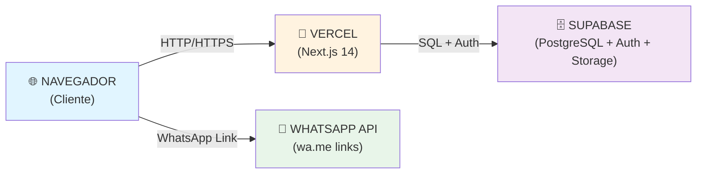
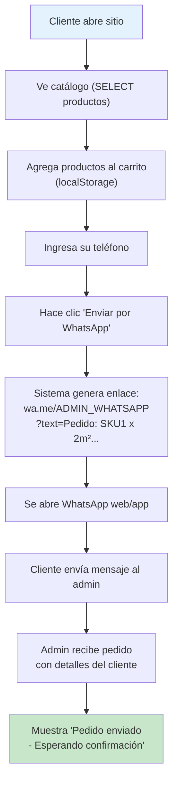
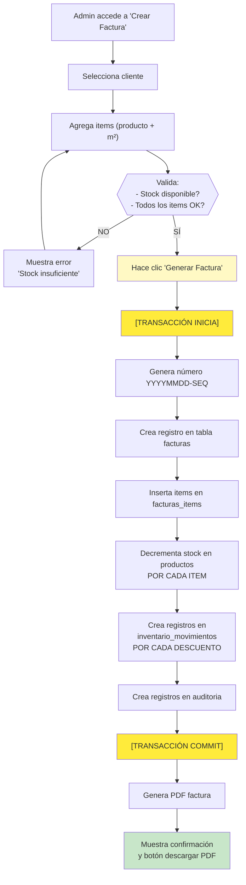
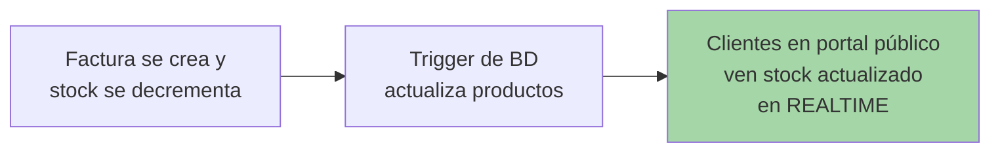

# Design — Plataforma de Gestión de Inventarios Beraca

- **Fecha:** 2026-09-18
- **Estado:** Borrador
- **Requirements:** [requirements.md](./requirements.md)

---

## 1. Resumen Ejecutivo

La plataforma Beraca es una aplicación web full-stack construida con Next.js 14 (TypeScript), desplegada en Vercel, con base de datos PostgreSQL en Supabase. La arquitectura está dividida en tres capas: (1) **Portada pública**: catálogo sin autenticación con carrito en localStorage y envío de pedidos por WhatsApp; (2) **Módulo Admin privado**: autenticación con Supabase Auth, 3 roles, CRUD de productos, gestión de inventario, generación de facturas con transacciones atómicas, auditoría completa; (3) **API serverless**: Next.js API Routes manejan lógica de negocio, validaciones y acceso a BD. La solución es MVP escalable a producción con costo operativo mínimo en Vercel + Supabase free tier.

---

## 2. Arquitectura de Alto Nivel



**Componentes principales:**

- **Frontend (Next.js Pages/App Router)**:
  - Página pública: `/` (catálogo, carrito, envío WhatsApp)
  - Módulo admin: `/admin/*` (privado, requiere auth)
  - Páginas: login, dashboard, productos, inventario, facturas, clientes, reportes, configuración

- **Backend (Next.js API Routes)**:
  - `/api/productos/*` (CRUD productos)
  - `/api/inventario/*` (movimientos, alertas)
  - `/api/facturas/*` (crear, listar, PDF)
  - `/api/clientes/*` (CRUD clientes)
  - `/api/auth/*` (login, logout, sesión)
  - `/api/reportes/*` (facturación, inventario)
  - `/api/auditoria/*` (historial)

- **Base de Datos (Supabase PostgreSQL)**:
  - Tablas: productos, inventario_movimientos, facturas, facturas_items, clientes, usuarios, auditoria
  - RLS (Row Level Security) para control de acceso

- **Autenticación (Supabase Auth)**:
  - Email/password
  - Gestión de roles/permisos en tabla `usuarios_roles`

---

## 3. Stack Tecnológico

| Capa | Tecnología | Justificación |
|------|-----------|---------------|
| **Frontend** | Next.js 14 + React 18 + TypeScript | Full-stack, SSR, API Routes integradas, DX excelente |
| **Estilos** | TailwindCSS + Shadcn/ui | Componentes reutilizables, responsive, accesible |
| **Formularios** | React Hook Form + Zod | Validación tipada, performance, UX fluida |
| **Backend** | Next.js API Routes | Serverless, sin servidor a mantener, escalable |
| **BD** | Supabase (PostgreSQL) | Relacional, RLS, Auth integrado, Storage, realtime |
| **ORM** | Prisma | Type-safe, migraciones automáticas, excelente DX |
| **Autenticación** | Supabase Auth | JWT, gestión de sesiones, passwordless ready |
| **PDF** | jsPDF + html2canvas | Ligero, sin dependencias backend |
| **Testing** | Vitest + Playwright | Unit tests rápidos, E2E browser automation |
| **Hosting** | Vercel | CI/CD automático, serverless, free tier adecuado |
| **Monitoreo** | Sentry (free) | Error tracking, performance monitoring |

---

## 4. Esquema de Base de Datos

### Tablas principales:

```sql
-- Usuarios y roles
CREATE TABLE usuarios (
  id UUID PRIMARY KEY DEFAULT gen_random_uuid(),
  email VARCHAR(255) UNIQUE NOT NULL,
  created_at TIMESTAMPTZ DEFAULT now(),
  updated_at TIMESTAMPTZ DEFAULT now()
);

CREATE TABLE usuarios_roles (
  id UUID PRIMARY KEY DEFAULT gen_random_uuid(),
  usuario_id UUID REFERENCES usuarios(id) ON DELETE CASCADE,
  rol VARCHAR(50) NOT NULL, -- 'admin', 'gerente', 'vendedor'
  created_at TIMESTAMPTZ DEFAULT now(),
  UNIQUE(usuario_id, rol)
);

-- Productos
CREATE TABLE productos (
  id UUID PRIMARY KEY DEFAULT gen_random_uuid(),
  sku VARCHAR(100) UNIQUE NOT NULL,
  nombre VARCHAR(255) NOT NULL,
  categoria VARCHAR(100) NOT NULL, -- 'baldosa', 'cerámica', 'porcelanato'
  dimensiones VARCHAR(50), -- ej: "30x30"
  color VARCHAR(100),
  acabado VARCHAR(100), -- 'mate', 'brillante', 'satinado'
  espesor_mm DECIMAL(4,2),
  m2_por_caja DECIMAL(6,2),
  precio_unitario DECIMAL(10,2) NOT NULL,
  costo DECIMAL(10,2),
  stock_actual DECIMAL(12,2) NOT NULL DEFAULT 0,
  stock_minimo DECIMAL(12,2) DEFAULT 0,
  proveedor VARCHAR(255),
  descripcion TEXT,
  imagen_url VARCHAR(500),
  activo BOOLEAN DEFAULT true,
  created_at TIMESTAMPTZ DEFAULT now(),
  updated_at TIMESTAMPTZ DEFAULT now(),
  created_by UUID REFERENCES usuarios(id)
);

CREATE INDEX idx_productos_sku ON productos(sku);
CREATE INDEX idx_productos_stock ON productos(stock_actual);

-- Clientes
CREATE TABLE clientes (
  id UUID PRIMARY KEY DEFAULT gen_random_uuid(),
  nombre VARCHAR(255) NOT NULL,
  email VARCHAR(255),
  telefono VARCHAR(20),
  cedula_cc VARCHAR(50) UNIQUE,
  direccion TEXT,
  termino_pago VARCHAR(50), -- 'contado', 'mixto'
  limite_credito DECIMAL(12,2) DEFAULT 0,
  activo BOOLEAN DEFAULT true,
  created_at TIMESTAMPTZ DEFAULT now(),
  updated_at TIMESTAMPTZ DEFAULT now(),
  created_by UUID REFERENCES usuarios(id)
);

CREATE INDEX idx_clientes_cedula ON clientes(cedula_cc);

-- Inventario - Movimientos (auditoría)
CREATE TABLE inventario_movimientos (
  id UUID PRIMARY KEY DEFAULT gen_random_uuid(),
  producto_id UUID REFERENCES productos(id) ON DELETE RESTRICT,
  tipo VARCHAR(50) NOT NULL, -- 'entrada', 'salida', 'factura', 'ajuste', 'anulacion'
  cantidad DECIMAL(12,2) NOT NULL,
  stock_antes DECIMAL(12,2) NOT NULL,
  stock_despues DECIMAL(12,2) NOT NULL,
  referencia_tipo VARCHAR(50), -- 'factura', 'pedido', 'compra'
  referencia_id UUID,
  motivo TEXT,
  usuario_id UUID REFERENCES usuarios(id),
  ip_address INET,
  created_at TIMESTAMPTZ DEFAULT now()
);

CREATE INDEX idx_inventario_producto ON inventario_movimientos(producto_id);
CREATE INDEX idx_inventario_tipo ON inventario_movimientos(tipo);
CREATE INDEX idx_inventario_fecha ON inventario_movimientos(created_at);

-- Facturas
CREATE TABLE facturas (
  id UUID PRIMARY KEY DEFAULT gen_random_uuid(),
  numero_factura VARCHAR(50) UNIQUE NOT NULL, -- YYYYMMDD-SECUENCIAL
  cliente_id UUID REFERENCES clientes(id),
  usuario_id UUID REFERENCES usuarios(id),
  fecha TIMESTAMPTZ DEFAULT now(),
  termino_pago VARCHAR(50), -- 'contado', 'mixto'
  metodo_pago VARCHAR(50), -- 'tarjeta', 'efectivo', 'transferencia'
  anticipo DECIMAL(12,2) DEFAULT 0,
  contra_entrega DECIMAL(12,2) DEFAULT 0,
  subtotal DECIMAL(12,2) NOT NULL,
  descuento_porcentaje DECIMAL(5,2) DEFAULT 0,
  descuento_monto DECIMAL(12,2) DEFAULT 0,
  impuesto DECIMAL(12,2) DEFAULT 0,
  total DECIMAL(12,2) NOT NULL,
  estado VARCHAR(50) DEFAULT 'pendiente', -- 'pendiente', 'pagada', 'anulada'
  observaciones TEXT,
  created_at TIMESTAMPTZ DEFAULT now(),
  updated_at TIMESTAMPTZ DEFAULT now()
);

CREATE INDEX idx_facturas_numero ON facturas(numero_factura);
CREATE INDEX idx_facturas_cliente ON facturas(cliente_id);
CREATE INDEX idx_facturas_estado ON facturas(estado);
CREATE INDEX idx_facturas_fecha ON facturas(fecha);

-- Facturas - Items
CREATE TABLE facturas_items (
  id UUID PRIMARY KEY DEFAULT gen_random_uuid(),
  factura_id UUID REFERENCES facturas(id) ON DELETE CASCADE,
  producto_id UUID REFERENCES productos(id) ON DELETE RESTRICT,
  cantidad_m2 DECIMAL(12,2) NOT NULL,
  precio_unitario DECIMAL(10,2) NOT NULL,
  subtotal DECIMAL(12,2) NOT NULL,
  created_at TIMESTAMPTZ DEFAULT now()
);

CREATE INDEX idx_facturas_items_factura ON facturas_items(factura_id);

-- Auditoría General
CREATE TABLE auditoria (
  id UUID PRIMARY KEY DEFAULT gen_random_uuid(),
  usuario_id UUID REFERENCES usuarios(id),
  tabla_afectada VARCHAR(100) NOT NULL,
  registro_id UUID NOT NULL,
  accion VARCHAR(50) NOT NULL, -- 'INSERT', 'UPDATE', 'DELETE'
  datos_antes JSONB,
  datos_despues JSONB,
  ip_address INET,
  user_agent TEXT,
  created_at TIMESTAMPTZ DEFAULT now()
);

CREATE INDEX idx_auditoria_tabla ON auditoria(tabla_afectada);
CREATE INDEX idx_auditoria_usuario ON auditoria(usuario_id);
CREATE INDEX idx_auditoria_fecha ON auditoria(created_at);

-- Configuración
CREATE TABLE configuracion (
  id UUID PRIMARY KEY DEFAULT gen_random_uuid(),
  clave VARCHAR(100) UNIQUE NOT NULL,
  valor VARCHAR(500),
  tipo VARCHAR(50), -- 'string', 'number', 'boolean'
  updated_at TIMESTAMPTZ DEFAULT now(),
  updated_by UUID REFERENCES usuarios(id)
);
```

**Índices para performance:**
- `idx_productos_sku`, `idx_productos_stock`
- `idx_clientes_cedula`
- `idx_inventario_producto`, `idx_inventario_tipo`, `idx_inventario_fecha`
- `idx_facturas_numero`, `idx_facturas_cliente`, `idx_facturas_estado`, `idx_facturas_fecha`
- `idx_auditoria_tabla`, `idx_auditoria_usuario`, `idx_auditoria_fecha`

---

## 5. Row Level Security (RLS)

**Política de RLS:**

```sql
-- Usuarios solo ven productos activos (públicamente visible)
CREATE POLICY "Productos visibles para todos"
  ON productos FOR SELECT
  USING (activo = true);

-- Usuarios autenticados (Admin/Gerente/Vendedor) ven todos los productos
CREATE POLICY "Productos completos para autenticados"
  ON productos FOR SELECT
  TO authenticated
  USING (true);

-- Solo Admin puede insertar/actualizar/eliminar productos
CREATE POLICY "Solo Admin puede modificar productos"
  ON productos FOR INSERT, UPDATE, DELETE
  TO authenticated
  USING (
    auth.uid() IN (
      SELECT usuario_id FROM usuarios_roles WHERE rol = 'admin'
    )
  );

-- Facturas: Usuario solo ve sus propias facturas, Admin ve todas
CREATE POLICY "Usuarios ven sus facturas"
  ON facturas FOR SELECT
  TO authenticated
  USING (
    usuario_id = auth.uid() 
    OR auth.uid() IN (SELECT usuario_id FROM usuarios_roles WHERE rol = 'admin')
  );
```

---

## 6. Flujos Críticos

### Flujo 1: Cliente envía pedido por WhatsApp



### Flujo 2: Admin genera factura (transacción atómica)



### Flujo 3: Catálogo realtime (cuando se vende)



---

## 7. Componentes React (Estructura)

```
src/
├── components/
│   ├── Layout/
│   │   ├── Header.tsx
│   │   ├── Sidebar.tsx
│   │   └── Footer.tsx
│   ├── Public/
│   │   ├── ProductCard.tsx
│   │   ├── Cart.tsx
│   │   ├── CartSummary.tsx
│   │   └── WhatsAppButton.tsx
│   ├── Admin/
│   │   ├── ProductForm.tsx
│   │   ├── ProductTable.tsx
│   │   ├── ClientForm.tsx
│   │   ├── ClientTable.tsx
│   │   ├── InvoiceForm.tsx
│   │   ├── InvoiceList.tsx
│   │   ├── InventoryTable.tsx
│   │   ├── ReportChart.tsx
│   │   └── AuditLog.tsx
│   └── Common/
│       ├── Button.tsx
│       ├── Input.tsx
│       ├── Modal.tsx
│       ├── Alert.tsx
│       ├── Loader.tsx
│       └── DataTable.tsx
├── pages/
│   ├── index.tsx (catálogo público)
│   ├── login.tsx
│   ├── admin/
│   │   ├── dashboard.tsx
│   │   ├── productos.tsx
│   │   ├── inventario.tsx
│   │   ├── facturas.tsx
│   │   ├── clientes.tsx
│   │   ├── reportes.tsx
│   │   ├── auditoria.tsx
│   │   └── configuracion.tsx
│   └── _app.tsx
├── api/
│   ├── productos/
│   │   ├── [id].ts (GET, PUT, DELETE)
│   │   └── index.ts (GET, POST)
│   ├── inventario/
│   │   └── movimientos.ts
│   ├── facturas/
│   │   ├── [id].ts
│   │   ├── index.ts
│   │   └── [id]/pdf.ts
│   ├── clientes/
│   │   ├── [id].ts
│   │   └── index.ts
│   ├── reportes/
│   │   ├── facturacion.ts
│   │   └── inventario.ts
│   ├── auditoria/
│   │   └── index.ts
│   ├── auth/
│   │   └── [...nextauth].ts (o Supabase auth)
│   └── configuracion/
│       └── whatsapp.ts
├── lib/
│   ├── supabase.ts (cliente)
│   ├── prisma.ts
│   ├── auth.ts
│   ├── pdf.ts (generador de PDFs)
│   ├── validators.ts (Zod schemas)
│   └── utils.ts
├── hooks/
│   ├── useAuth.ts
│   ├── useCart.ts
│   ├── useProducts.ts
│   └── useFetch.ts
├── types/
│   ├── index.ts (tipos globales)
│   ├── products.ts
│   ├── invoices.ts
│   └── clients.ts
└── styles/
    └── globals.css
```

---

## 8. API Routes (Endpoints principales)

| Método | Ruta | Autenticación | Descripción |
|--------|------|---------------|-------------|
| GET | `/api/productos` | Pública | Listar productos (stock realtime) |
| POST | `/api/productos` | Admin | Crear producto |
| GET | `/api/productos/[id]` | Pública | Obtener producto |
| PUT | `/api/productos/[id]` | Admin | Actualizar producto |
| DELETE | `/api/productos/[id]` | Admin | Eliminar producto |
| GET | `/api/inventario/movimientos` | Auth | Historial de movimientos |
| POST | `/api/inventario/movimientos` | Auth | Registrar entrada/salida |
| POST | `/api/facturas` | Auth | Crear factura (transacción) |
| GET | `/api/facturas` | Auth | Listar facturas |
| GET | `/api/facturas/[id]` | Auth | Obtener factura |
| GET | `/api/facturas/[id]/pdf` | Auth | Descargar PDF |
| PUT | `/api/facturas/[id]` | Auth | Actualizar factura (solo estado) |
| POST | `/api/clientes` | Auth | Crear cliente |
| GET | `/api/clientes` | Auth | Listar clientes |
| GET | `/api/clientes/[id]` | Auth | Obtener cliente |
| PUT | `/api/clientes/[id]` | Auth | Actualizar cliente |
| GET | `/api/reportes/facturacion` | Auth | Reportes de ventas |
| GET | `/api/reportes/inventario` | Auth | Reportes de stock |
| GET | `/api/auditoria` | Admin | Log de auditoría |
| GET | `/api/configuracion` | Admin | Obtener configuración |
| PUT | `/api/configuracion/[clave]` | Admin | Actualizar configuración |

---

## 9. Manejo de Errores

| Situación | Comportamiento | Mensaje al usuario |
|-----------|-------|---------|
| Stock insuficiente | Rechazar creación de factura | "Stock insuficiente para producto X. Disponible: Y m²" |
| Fila malformada en importación | Log a auditoria, continuar | "Fila N ignorada por error" |
| Usuario sin permiso | Return 403 Forbidden | "No tienes permisos para esta acción" |
| BD no disponible | Retry con backoff | "Error temporal. Reintentando..." |
| SKU duplicado | Rechazar creación | "El SKU ya existe" |
| Fallo generación PDF | Log error, mostrar retry | "Error al generar PDF. Intenta de nuevo" |
| Sesión expirada | Redirigir a login | "Tu sesión expiró. Por favor ingresa nuevamente" |
| Validación fallida (Zod) | Return 400 Bad Request | Detalles específicos del campo |

---

## 10. Estrategia de Testing

- **Unitarios (Vitest)**:
  - Funciones de validación (Zod schemas)
  - Funciones utilitarias (cálculo de totales, generación de números)
  - Hooks de React

- **Integración**:
  - API Routes con BD (conexión Supabase)
  - Flujos de creación de factura
  - Actualización de stock

- **E2E (Playwright)**:
  - Cliente: Ver catálogo → agregar carrito → enviar WhatsApp
  - Admin: Login → crear producto → crear factura → verificar stock
  - Admin: Login → generar reporte → descargar PDF

- **Cobertura mínima**: 70% líneas críticas (auth, facturas, inventario)

---

## 11. Alternativas Consideradas

- **Vercel vs Netlify**: Vercel ganó por integración nativa Next.js, preview en PRs, serverless functions más robustas.
- **Supabase vs Firebase**: Supabase ganó por modelo relacional (transacciones ACID), RLS nativo, mejor control.
- **jsPDF vs Puppeteer**: jsPDF ganó por peso (sin headless browser), velocidad, suficiente para PDFs simples.
- **Prisma vs Raw SQL**: Prisma ganó por type-safety, migrations automáticas, DX superior.
- **localStorage vs BD para carrito**: localStorage ganó porque es MVP, sin necesidad de persistencia entre dispositivos.

---

## 12. Riesgos y Mitigaciones

| Riesgo | Impacto | Mitigación |
|--------|--------|-----------|
| Cold start de Vercel | Latencia inicial | Keep-alive pings, caché de resultados |
| Transacción BD falla | Stock inconsistente | Usar transacciones explícitas en Prisma, retry logic |
| Concurrencia: 2 vendedores crean factura simultáneamente | Oversell | Row-level locking en BD, validación última hora |
| Imagen muy grande de producto | Timeout upload | Validar tamaño (< 5MB), comprimir automáticamente |
| BD llena (free tier Supabase) | Sistema no funciona | Monitoreo de uso, plan de cleanup de auditoría |
| WhatsApp API cambia formato | Pedidos no llegan | Usar wa.me (enlace estándar, menos propenso a cambios) |

---

## 13. Preguntas Abiertas

- ¿Se implementará validación de CC/Cédula con API externa?
- ¿Nivel de impuesto (IVA/ICAC) por jurisdicción?
- ¿Soporte multiidioma desde MVP?
- ¿Integración con email en fase 1.5 o fase 2?

---

**Estado:** Listo para Approval Gate 2 → Tasks

